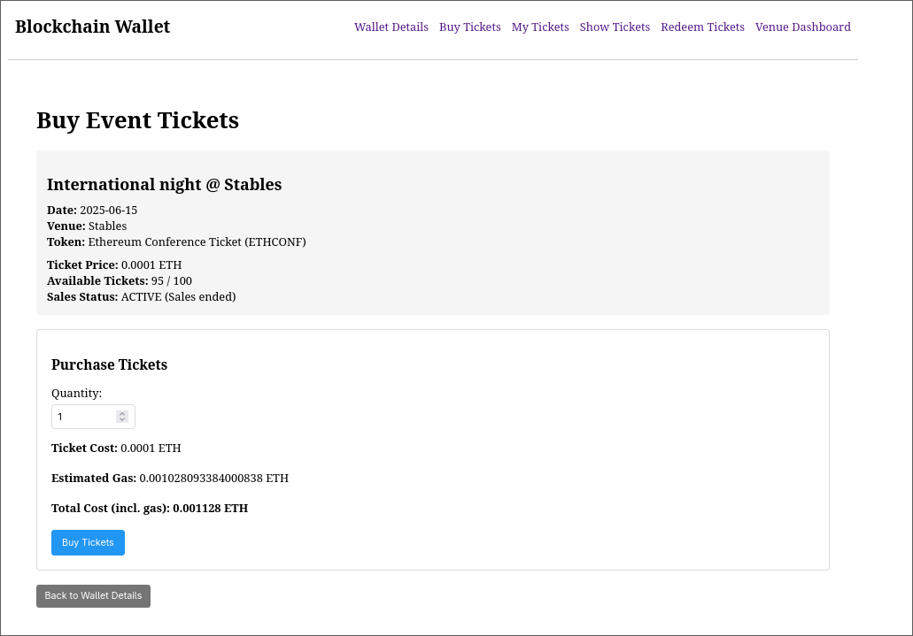
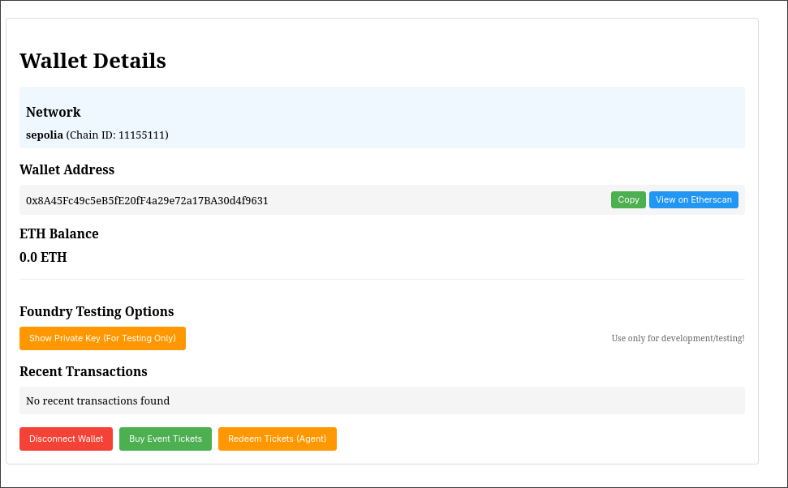
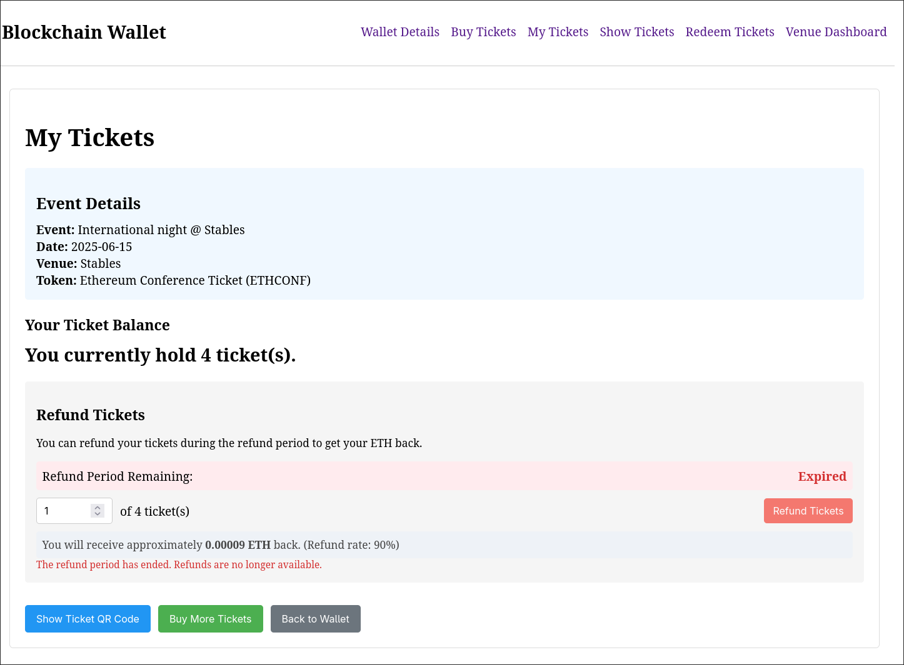

# Dapp Ticket Sales Platform

Built for Block 2.3 | ISE. A decentralized event ticketing system using Ethereum smart contracts.

## What it does

- Buy tickets with ETH
- View and manage owned tickets  
- Generate QR codes for venue entry
- Venue dashboard for event organizers
- Refund system during specified periods
- Door staff management

## Screenshots

<table>
<tr>
<td width="50%">

 <em>Generate QR codes for ticket redemption at venues</em>
</td>
<td width="50%">

 <em>Purchase tickets with ETH, shows gas fees and total cost</em>
</td>
</tr>
<tr>
<td width="50%">

 <em>Wallet info, balance, and transaction history on Sepolia testnet</em>
</td>
<td width="50%">

 <em>View owned tickets and request refunds during refund period</em>
</td>
</tr>
</table>

 <em>Event organizers can see ticket sales, manage refund periods, and add door staff</em>

## Tech Stack

- React + TypeScript + Vite
- Ethereum (Sepolia testnet)
- Solidity smart contracts with Foundry
- ERC-20 tokens for tickets

## Setup

Check `guide_to_running.md` for setup instructions.

---

Listen, idk how i feel bout cryptocurrency/blockchain. But this seems like a pretty good usecase!
